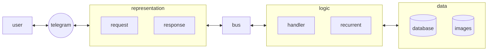

# 🚶‍♂️ Step Counter

Есть чатик, члены которого считают шаги и ведут статистику.

Данный бот реализует автоматизацю этого процесса:

- Каждый день участники указывают количество пройденных шагов
- В конце месяца отмечается победитель

# 🗒 Дорожная карта

Ведётся в Trello: [Step Counter](https://trello.com/b/V2Gv4nIh/step-counter)

# 🏗 Архитектура

