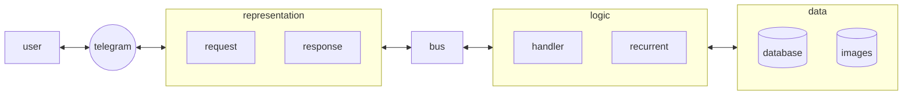

# Step Counter bot

Есть чатик, члены которого считают шаги и ведут статистику.

Данный бот реализует автоматизацю этого процесса:

- Каждый день участники указывают количество пройденных шагов
- Бот ведёт учет
- В конце месяца отмечается победитель

# План

## Прототип

- [x] Есть Google Spreadsheet таблица
- [x] Бот пишет в чат в заданное время (10:00 каждого дня по МСК) с просьбой отметить свой прогресс
- [x] Пользователи отвечают боту через Reply, сколько шагов было пройдено
- [x] Бот записывает информацию в таблицу
- [ ] Каждый год создаётся новый лист в таблице

## Дополнительные фичи

- [x] Создать отдельного бота под dev цели
- [x] Интернационализация
- [x] Возможность запросить статистику о себе (напр. `/me@step_counter_bot`)
- [x] Постить общую статистику в графическом виде
  - [x] По запросу (напр. `/leaders@step_counter_bot`)
  - [x] Периодически
- [x] Возможность добавлять данные за произвольную дату

## Переход в Production режим

- [ ] Написание публичной документации
 - [ ] Выставление документации по `/help`
- [x] Ревизия архитектуры, консультации
- [x] Рефакторинг кода
  - [x] Внедрение новых подходов, если были определены
  - [ ] Исправления по DRY
  - [ ] Исправления по интерфейсу к БД
- [ ] Использование настоящей БД
  - [ ] Выбор и интеграция БД
  - [ ] Скрипт импорта и экспорта для Spreadsheet

# Архитектура

