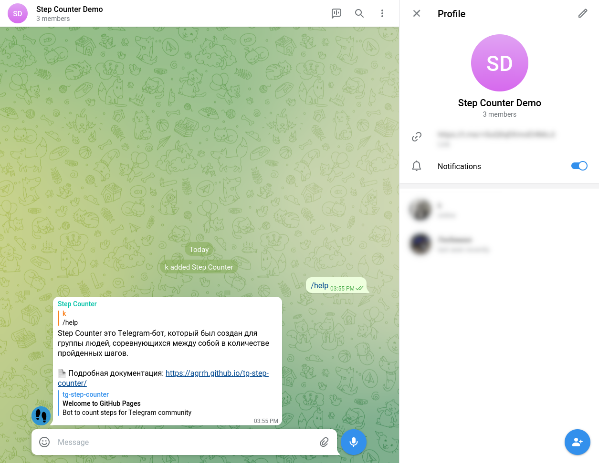

---

permalink: /add-bot-to-group/

---

[На главную страницу](index.md)

# Добавьте бота в группу

## Кратко

Достаточно добавить в группу бота по [логину](https://t.me/step_counter_bot):

`step_counter_bot`

## Пошаговое описание

Откройте желаемую группу:

Выберите опцию "Добавить пользователя" и найдите бота по имени [@step_counter_bot](https://t.me/step_counter_bot):

Добавьте бота в группу:

Готово!

# Далее

Готово, теперь можно переходить ко [вводу данных](../adding-results/).
