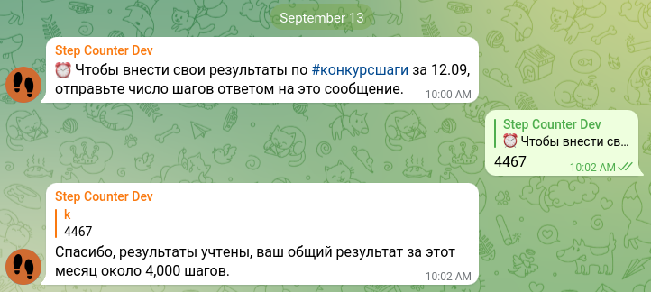
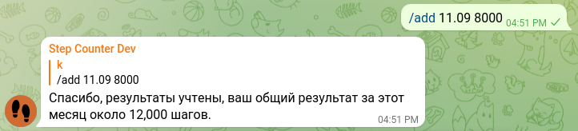
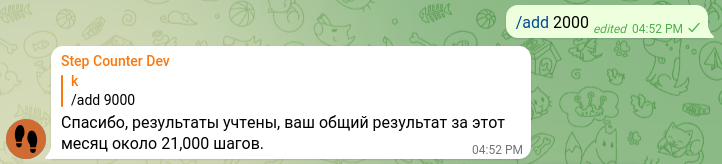

---

permalink: /adding-results/

---

# Вносите свои результаты

## Регулярно, за предыдущий день

Каждый день, в заданное время (по умолчанию в 10:00 по указанному часовому поясу), бот будет присылать сообщение с напоминанием.

Достаточно ответить боту числом пройденных Вами шагов и результат будет записан.

Пример:

>⚠️ Обратите внимание, число не должно содержать других знаков, букв или отступов



## Разово, за произвольную дату

Если Вы пропустили какой-то день или хотите уточнить данные за предыдущую дату, воспользуйтесь командой ввода за произвольную дату:

```
/add 11.09 8000
```



Также можно уточнить данные за сегодняшний день, если указать только число шагов, без даты:

```
/add 2000
```



# Далее

Вы можете отслеживать [прогресс турнира и свой собственный](../tracking-progress/).
