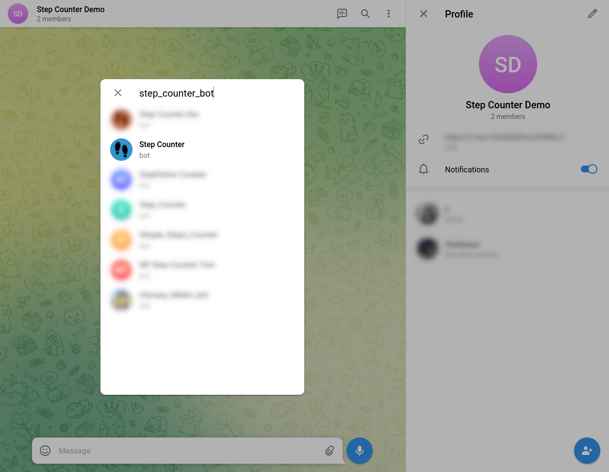
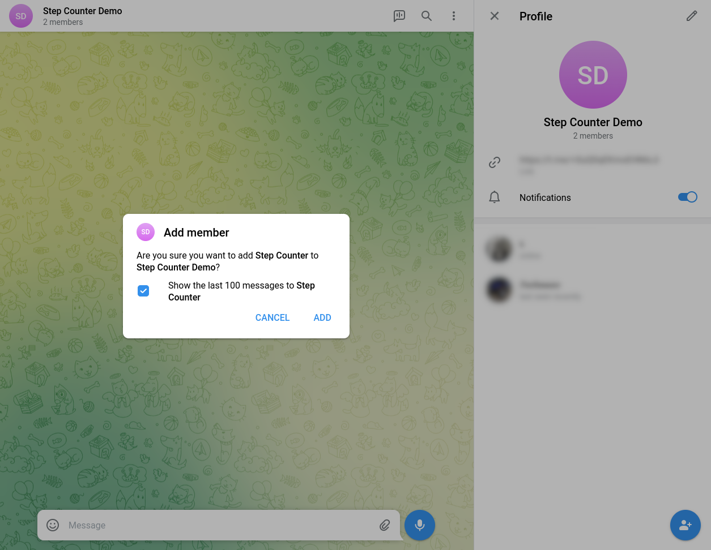

# Step Counter

Step Counter это Telegram-бот, который был создан для группы людей, соревнующихся между собой в количестве пройденных шагов.

Легкий и понятный в управлении, подойдет как для небольшой группы друзей, так и для зрелого сообщества.

## Возможности

- Подсчет персональных результатов
- Ежемесячное соревнование с поздравлением победителя

## Как начать пользоваться?

### Добавьте бота в группу

- Откройте желаемую группу

  

- Выберите опцию "Добавить пользователя"

  

- Найдите бота по имени [@step_counter_bot](https://t.me/step_counter_bot)

  

- Добавьте бота в группу

  

### Как добавить свои результаты

#### Регулярно за предыдущий день

Каждый день в 10.00 MSK бот присылвет сообщение с напоминанием внести данные за предыдущий день. Пример:

СКРИНШОТ

Ответом на это сообщение вводите число

СКРИНШОТ

(Обратите внимание, число не должно содержать других знаков, букв или отступов)

Отправляете сообщение

СКРИНШОТ

В ответ бот присылает вам уведомление о записи вашего резуьтата и выводит округленное число шагов в сумме за месяц.

СКРИНШОТ

#### За произвольную дату

! Добавить позже

### Как посмотреть свои результаты

! Добавить позже

### Как посмотреть общий рейтинг

! Добавить позже

### Как работает конкурсная система

! Добавить позже

## Авторы

- [Kirill](https://github.com/agrrh)
- [Tatiana](https://github.com/stska007)
